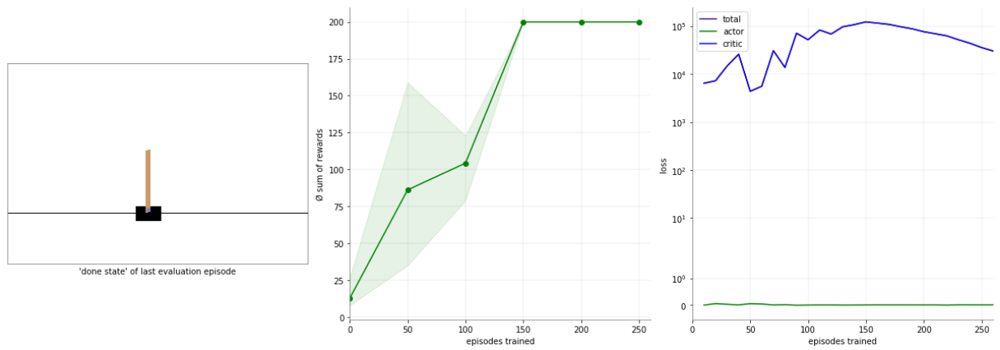
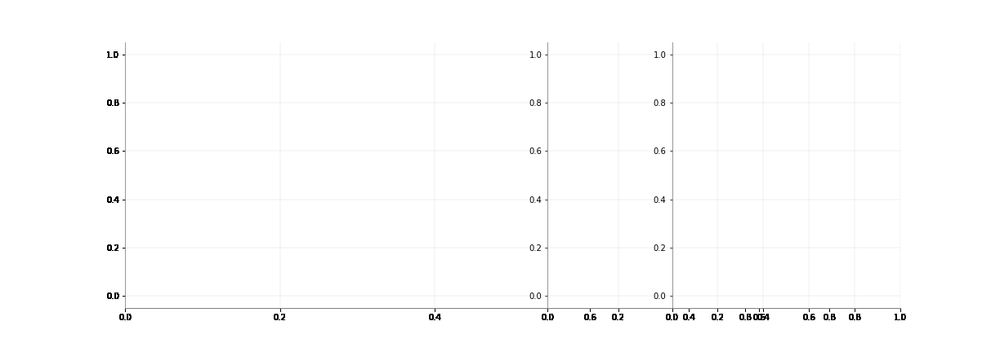

### Reinforcement Learning for Practitioners (v1.1, 19Q3)


Status: under active development, breaking changes may occur. [Release notes](documentation/README.md).


EasyAgents is a high level reinforcement learning api focusing on ease of use and simplicity.
Written in Python and running on top of different reinforcement learning libraries like
[tf-Agents](https://github.com/tensorflow/agents), 
[tensorforce](https://github.com/tensorforce/tensorforce) or 
[keras-rl](https://github.com/keras-rl/keras-rl).
Environments are implemented in [OpenAI gym](https://github.com/openai/gym). 


### Use EasyAgents if
* you want to compare different algorithms and implementations, easily switch between the implementations,
  without having to learn the details first
* you like easily interpretable plots, consistent across all algorithms and backends
* you have a gym environment and want to experiment with it (inside or outside of a jupyter notebook)
* you are looking for a simple 2 lines of code api to run and evaluate algorithms against your environment  

Try it on colab:
* [Cartpole on colab](https://colab.research.google.com/github/christianhidber/easyagents/blob/master/jupyter_notebooks/easyagents_cartpole.ipynb)
  introduction: training, plotting, switching algorithms & backends. based on the classic reinforcement learning example 
   balancing a stick on a cart.
* [Orso on colab](https://colab.research.google.com/github/christianhidber/easyagents/blob/master/jupyter_notebooks/easyagents_orso.ipynb):
  custom training, creating a movie, switching backends & logging. gym environment based on a routing problem.
* [LineWorld on colab](https://colab.research.google.com/github/christianhidber/easyagents/blob/master/jupyter_notebooks/easyagents_line.ipynb)
  implement your own environment, workshop example.

In collaboration with [Oliver Zeigermann](http://zeigermann.eu/). 

### Scenario: simple
````
from easyagents.agents import PpoAgent
from easyagents.callbacks import plot

ppoAgent = PpoAgent('CartPole-v0')
ppoAgent.train([plot.State(), plot.Loss(), plot.Rewards()])
````


### Scenario: more detailed
````
from easyagents.agents import PpoAgent
from easyagents.callbacks import plot

ppoAgent = PpoAgent( 'Orso-v1',fc_layers=(500,500,500))
ppoAgent.train([plot.State(), plot.Loss(), plot.Rewards(), plot.Actions(), 
                plot.StepRewards(), plot.Steps(), plot.ToMovie()], 
                learning_rate = 0.0001, num_iterations = 500, max_steps_per_episode=50 )
````



### Available Algorithms and Backends

|algorithm | [tf-Agents](https://github.com/tensorflow/agents) | [tensorforce](https://github.com/tensorforce/tensorforce) | [keras-rl](https://github.com/keras-rl/keras-rl) | easyagents class name |
|----------|:---------:|:-----------:|:--------:| :---: | 
|[CEM](citeseerx.ist.psu.edu/viewdoc/download?doi=10.1.1.81.6579&rep=rep1&type=pdf) |`not available`  |`not available`  |`open`  | `open` | 
|[Dqn](https://arxiv.org/abs/1312.5602)           |`yes`           |`open`    |`yes`            | DqnAgent | 
|[Double Dqn](https://arxiv.org/abs/1509.06461)   |`not available` |`open`    |`yes`            | DoubleDqnAgent|
|[Dueling Dqn](https://arxiv.org/abs/1511.06581)  |`open`          |`open`    |`yes`            | DuelingDqnAgent|
|[Ppo](https://arxiv.org/abs/1707.06347)          |`yes`           |`yes`     |`not available`  | PpoAgent |
|Random                                           |`yes`           |`open`    |`open`           | RandomAgent |
|[REINFORCE](www-anw.cs.umass.edu/~barto/courses/cs687/williams92simple.pdf)  |`yes`  |`yes` |`open`| ReinforceAgent | 
|[SAC](https://arxiv.org/abs/1801.01290)          |`open`          |`not available`|`not available`|`open`|

[october 2019]


### Guiding Principles
* **easily train, evaluate & debug policies for (you own) gym environment** over "designing new algorithms"
* **simple & consistent** over "flexible & powerful"
* **inspired by keras**: 
    * same api across all algorithms
    * support different implementations of the same algorithm 
    * extensible (pluggable backends, plots & training schemes)   

### Installation
Install from pypi using pip:

```python
pip install easyagents
```

### Documentation
[release notes, class diagrams](documentation/README.md)

### EasyAgents may not be ideal if

* you would like to leverage implementation specific advantages of an algorithm
* you want to do distributed or in parallel reinforcement learning

### Note

* This repository is under active development and in an early stage. 
  Thus any- and everything may (and probably should) change.
* If you have any difficulties in installing or using easyagents please let us know. 
  We'll try to do our best to help you.
* Any ideas, help, suggestions, comments etc in python / open source development / reinforcement learning / whatever
  are more than welcome. Thanks a lot in advance.
